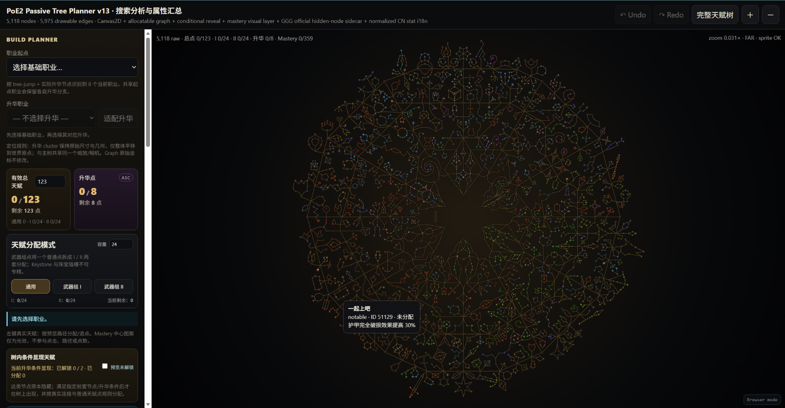

# poe2-agent-tools

面向《Path of Exile 2》的构建规划器、数据编译工具与 AI Agent 结构化知识库。

> 当前仓库来自 ChatGPT 开发会话导出，已在 2026-09-08 完成第一次 Git 整理。现阶段是可运行的原型，不是正式发行版。



## 项目内容

| 路径 | 状态 | 用途 |
| --- | --- | --- |
| `apps/planner-desktop/` | 主开发版本 | Electron 桌面规划器，带本地数据缓存 |
| `apps/planner-web/src/` | 原型快照 | 浏览器版 v13，保留导出时的完整实现 |
| `tools/jewel-compiler/` | 可运行工具 | 从 PoE2DB、PoB2 与官方数据生成珠宝规则数据 |
| `docs/assets/` | 参考资料 | 实际运行截图与界面概念图 |

## 快速开始

需要 Node.js 20 或更高版本。

```bash
cd apps/planner-desktop
npm install
npm start
```

首次运行时会从官方/GitHub CDN 获取核心数据并保存到 Electron 用户数据目录。缓存成功后，可离线使用已经下载的内容。

仅查看浏览器原型时，可直接打开 `apps/planner-web/src/index.html`。由于浏览器安全策略和远程数据依赖，推荐通过本地静态服务器访问。

## 开发检查

```bash
cd apps/planner-desktop
npm run check

cd ../../tools/jewel-compiler
node --check download_poe2_jewel_sources.mjs
node --check build-jewel-db.mjs
```

## 当前边界

- Planner 的核心仍是单文件实现，尚待按 Graph、Allocation、Renderer 和 RuleEngine 拆分。
- 桌面版的数据缓存已实现，但仓库不提交下载后的大型运行时资源。
- 珠宝编译器带有小型 fixture 和示例输出；完整编译前需先下载完整上游数据。
- 游戏名称、图像和数据的权利归各自权利人所有；本仓库与 Grinding Gear Games 无隶属或背书关系。

后续开发方向见 [docs/ROADMAP.md](docs/ROADMAP.md)，代码结构见 [docs/ARCHITECTURE.md](docs/ARCHITECTURE.md)。
